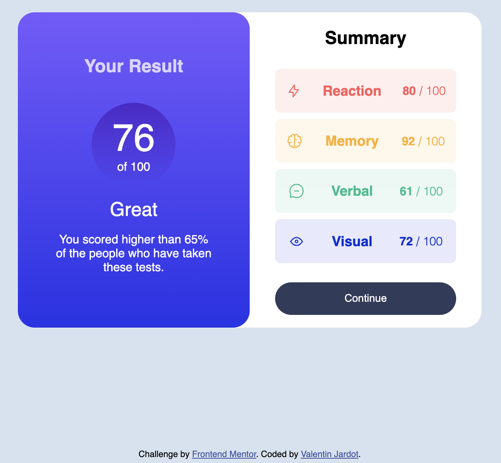

# Frontend Mentor - Results summary component solution

This is a solution to the [Results summary component challenge on Frontend Mentor](https://www.frontendmentor.io/challenges/results-summary-component-CE_K6s0maV/hub). Frontend Mentor challenges help you improve your coding skills by building realistic projects. 

## Contents

- [Overview](#overview)
  - [The challenge](#the-challenge)
  - [Screenshot](#screenshot)
  - [Links](#links)
- [Author](#author)

## Overview

### The challenge

Users should be able to:

- View the optimal layout for the interface depending on their device's screen size
- See hover and focus states for all interactive elements on the page

### Screenshot

#### *Mobile version :*

#### *Desktop version :*

### Links

- Live Site URL : [https://valentinjardot.github.io/results-summary-component-main/](https://valentinjardot.github.io/results-summary-component-main/)
- Repo Github : [https://github.com/ValentinJardot/results-summary-component-main](https://github.com/ValentinJardot/results-summary-component-main)

## Author

- Website - [valentinjardot.com](http://valentinjardot.com/)
- Frontend Mentor - [@ValentinJardot](https://www.frontendmentor.io/profile/ValentinJardot)
- GitHub - [@ValentinJardot](https://github.com/ValentinJardot)
- LinkdIn - [Valentin Jardot](https://www.linkedin.com/in/valentin-jardot/)
